# Hadivo Attendance System

[](https://github.com/feronsadana54/hadivo-backend/actions/workflows/backend-ci.yml)
[](https://github.com/feronsadana54/hadivo-backend/actions/workflows/web-ci.yml)
[](https://github.com/feronsadana54/hadivo-backend/actions/workflows/mobile-ci.yml)

Hadivo adalah sistem absensi multi-tenant berbasis lokasi untuk sekolah dan perusahaan. Project ini berisi backend Kotlin Spring Boot, Web Dashboard Next.js, Flutter Mobile Attendance App MVP, Super Admin Console read-only, Device Binding, dan Notification Gateway Foundation untuk kebutuhan portfolio SaaS attendance system.

Repository ini berisi backend Fase 1 (MVP), web dashboard admin Fase 2, dan mobile app MVP untuk user attendance.

## Stack

- Backend Kotlin + Spring Boot 3.3
- Web Dashboard Next.js + TypeScript + Tailwind CSS
- Mobile Flutter + Dart
- Java 21
- PostgreSQL 16 + Flyway
- RabbitMQ 3 (notification event gateway)
- Gradle Kotlin DSL
- JWT (access + refresh) dengan refresh token disimpan sebagai SHA-256 hash
- springdoc-openapi untuk Swagger UI

## Highlight

- Geolocation attendance validation dengan Haversine radius check.
- Attendance attempts audit untuk percobaan gagal seperti `OUT_OF_RADIUS`, `FACE_MISMATCH`, dan `DUPLICATE_CLOCK_IN`.
- Role-based dashboard untuk admin tenant, manager, teacher, employee, student, dan parent.
- Web dashboard untuk login, summary, attendance, attempts, notifications, members, shifts, settings, locations, subscription, dan Super Admin Console.
- Super Admin Console v0.5.0 untuk memantau tenant lintas platform secara read-only.
- Device Binding v0.6.0 untuk membatasi absensi user ke satu trusted device per tenant, dengan reset perangkat oleh admin.
- Notification Gateway v0.8.0 dengan RabbitMQ async flow, delivery log, in-app delivery, default mock/log-only provider, dan optional Resend/FCM provider.
- Advanced export v0.9.0 untuk laporan attendance dalam format CSV, Excel, dan PDF dengan batas range MVP 31 hari.
- Subscription Payment Foundation v1.0.0 dengan payment provider mock default, optional Midtrans Snap, payment record, webhook idempotent, dan aktivasi subscription dari backend.
- Shift & Flexible Schedule v1.1.0 dengan shift template, assignment anggota, fallback ke attendance settings tenant, overnight shift sederhana, dan late calculation berdasarkan shift.
- Leave / Permission Request Foundation v1.2.0 untuk pengajuan sakit, izin, cuti sederhana, dinas luar, dan koreksi absensi dengan flow approve/reject/cancel, overlay di daily report + export, audit log, dan event notifikasi.
- Attendance Correction Apply Engine v1.3.0 menerapkan approved ATTENDANCE_CORRECTION ke `attendance_records` dalam transaksi yang sama dengan approve, dengan audit trail diff penuh di `attendance_correction_applies`, idempotency per leave request, dan jaminan tidak menyentuh lat/long/device/face/attempt history.
- Leave Balance / Quota Foundation v1.4.0 menambahkan policy cuti tahunan per tenant, saldo cuti per user/tahun, ledger audit untuk setiap perubahan (`INITIAL` / `DEDUCT` / `ADJUST`), pengurangan saldo otomatis saat `ANNUAL_LEAVE` disetujui, halaman web `Saldo Cuti` untuk admin, dan card read-only di profile mobile.
- Holiday / Workday Calendar Foundation v1.5.0 menambahkan hari kerja per tenant (Senin–Minggu) dan daftar hari libur (CUSTOM / NATIONAL / COMPANY / SCHOOL), perhitungan durasi cuti berbasis hari kerja, deduksi `ANNUAL_LEAVE` memakai workday count (Jum–Sen = 2 hari, bukan 4), dan halaman web `Kalender Kerja`.
- Halaman Locations web memakai map picker berbasis Leaflet + OpenStreetMap dengan address search Nominatim untuk memilih titik absensi dan melihat radius geofence.
- Flutter mobile MVP untuk login, attendance hari ini, clock-in, clock-out, history, profile, dan logout.
- UX web dan mobile memakai label sederhana, status badge, empty state, dan pesan error yang lebih mudah dipahami user awam.
- Event notification pipeline memakai RabbitMQ.
- Database migration memakai Flyway dan PostgreSQL.
- Security baseline mencakup tenant isolation, role guard, audit log, login protection, refresh token rotation, dan security headers dasar.

## Struktur

```
hadivo-attendance-system/
├── backend/          aplikasi Kotlin
├── docker/           docker-compose untuk Postgres + RabbitMQ
├── docs/             dokumentasi internal (overview, flow, schema, ADR)
├── postman/          Postman collection untuk QA manual
├── mobile/           Flutter mobile attendance MVP
└── web/              dashboard admin tenant
```

## Menjalankan lokal

1. Pastikan Docker dan JDK 21 terpasang.
2. `cp .env.example .env` lalu sesuaikan kalau perlu.
3. Naikkan infrastruktur:
   ```
   docker compose -f docker/docker-compose.yml up -d
   ```
4. Jalankan test dan backend:
   ```
   cd backend
   .\gradlew.bat clean test
   .\gradlew.bat bootRun
   ```
5. Swagger UI: <http://localhost:8080/swagger-ui.html>
6. Login pakai user seed `superadmin@hadivo.local` / `ChangeMe123!` (ganti password segera).

## Menjalankan web dashboard

Backend harus berjalan di <http://localhost:8080>.

```
cd web
npm install
cp .env.example .env.local
npm run dev
```

Web dashboard tersedia di <http://localhost:3000>. Login default: `superadmin@hadivo.local` / `ChangeMe123!`.

Super Admin Console tersedia di `/super-admin`. Fitur ini read-only untuk platform owner, hanya boleh diakses role `SUPER_ADMIN`, dan menampilkan overview lintas tenant, daftar tenant, detail tenant, ringkasan member, absensi hari ini, failed attempts hari ini, serta status subscription. Console ini tidak menyediakan edit/delete tenant, impersonation, face recognition asli, FCM/email production, atau device management dari Super Admin.

Device Binding v0.6.0 mendaftarkan perangkat absensi pertama user sebagai trusted device untuk tenant tersebut. Clock-in/clock-out dari perangkat berbeda akan ditolak dengan pesan agar user menghubungi admin. Admin tenant dapat reset perangkat dari halaman Members agar user bisa mendaftarkan perangkat baru pada absensi berikutnya. Mobile app memakai random device UUID yang disimpan di secure storage, bukan hardware identifier mentah.

Notification Gateway memproses event absensi lewat RabbitMQ queue `hadivo.notification.events`, menyimpan delivery log tenant-scoped, dan memakai provider mock/log-only secara default. v0.8.0 menambahkan provider optional Resend untuk email dan Firebase Cloud Messaging untuk push notification. Jika konfigurasi provider real belum lengkap, sistem tetap berjalan memakai mock/log-only provider. Halaman `/notifications` menampilkan delivery log secara read-only untuk admin.

Halaman Attendance web dapat mengunduh laporan attendance dalam format CSV, Excel, dan PDF. CSV tetap cocok untuk integrasi sederhana, Excel ditujukan untuk analisis dan operasional admin, sedangkan PDF ditujukan untuk laporan formal. Untuk MVP, export attendance dibatasi maksimal 31 hari per request dan belum memakai streaming besar atau penyimpanan file permanen.

Halaman Subscription web dapat membuat payment request dari package catalog backend dan menampilkan riwayat payment tenant. Provider default adalah `mock` agar local dev dan CI tidak membutuhkan API key. Midtrans Snap bersifat optional; subscription hanya aktif setelah backend menerima webhook valid dan idempotent, bukan dari callback frontend.

Panduan manual QA payment tersedia di [`docs/14-payment-qa-guide.md`](docs/14-payment-qa-guide.md). Panduan manual QA leave/permission tersedia di [`docs/17-leave-qa-guide.md`](docs/17-leave-qa-guide.md). Panduan manual QA attendance correction apply tersedia di [`docs/18-correction-qa-guide.md`](docs/18-correction-qa-guide.md). Detail policy, balance, dan ledger cuti tahunan tersedia di [`docs/21-leave-balance.md`](docs/21-leave-balance.md). Panduan manual QA leave balance tersedia di [`docs/22-leave-balance-qa-guide.md`](docs/22-leave-balance-qa-guide.md). Detail workday settings, holiday calendar, dan workday-based deduction tersedia di [`docs/23-holiday-workday-calendar.md`](docs/23-holiday-workday-calendar.md).

Untuk mengaktifkan Resend, buat API key di Resend lalu set:

```
HADIVO_NOTIFICATION_EMAIL_PROVIDER=resend
RESEND_API_KEY=...
RESEND_FROM_EMAIL=no-reply@domain-kamu.com
```

Untuk mengaktifkan Firebase Cloud Messaging backend, siapkan Firebase project dan service account JSON di luar repo, lalu set:

```
HADIVO_NOTIFICATION_PUSH_PROVIDER=fcm
FCM_ENABLED=true
FCM_PROJECT_ID=...
FCM_SERVICE_ACCOUNT_PATH=/absolute/path/to/firebase-service-account.json
```

Untuk mobile FCM, setup Firebase manual untuk Android/iOS, letakkan file config di lokasi platform yang sesuai, lalu jalankan app dengan:

```
flutter run --dart-define=HADIVO_ENABLE_FIREBASE_MESSAGING=true
```

Payment provider default adalah mock. Untuk mencoba Midtrans Snap sandbox, set env berikut secara lokal:

```
HADIVO_PAYMENT_PROVIDER=midtrans
HADIVO_PAYMENT_MIDTRANS_ENABLED=true
HADIVO_PAYMENT_MIDTRANS_ENVIRONMENT=sandbox
MIDTRANS_SERVER_KEY=...
MIDTRANS_CLIENT_KEY=...
MIDTRANS_SNAP_BASE_URL=https://app.sandbox.midtrans.com
MIDTRANS_API_BASE_URL=https://api.sandbox.midtrans.com
```

Jika provider diset ke `midtrans` tetapi konfigurasi belum lengkap, backend tetap memakai mock provider agar aplikasi tidak gagal start.

Webhook Midtrans diarahkan ke:

```
POST /api/v1/payments/webhooks/midtrans
```

Jangan commit `RESEND_API_KEY`, `MIDTRANS_SERVER_KEY`, `MIDTRANS_CLIENT_KEY`, service account JSON, `google-services.json` production, `GoogleService-Info.plist`, FCM token, atau file credential lain. Kegagalan provider notifikasi dicatat di delivery log dan tidak menggagalkan absensi.

Halaman Locations menyediakan map picker berbasis Leaflet + OpenStreetMap. Admin dapat klik peta untuk mengisi latitude/longitude, melihat marker, dan melihat circle radius sebelum menyimpan. Admin juga dapat mencari alamat atau nama tempat memakai Nominatim OpenStreetMap lewat tombol Cari Lokasi atau tombol Enter; fitur ini bukan live autocomplete. Fitur ini tidak membutuhkan Google Maps API key, billing, atau akun pihak ketiga. Untuk traffic production yang besar, gunakan tile/geocoding provider resmi/berbayar atau self-hosted tile/Nominatim yang sesuai dengan policy OpenStreetMap.

Detail langkah-langkah ada di [`docs/10-local-development.md`](docs/10-local-development.md).

Panduan shift dan jadwal fleksibel tersedia di [`docs/15-shift-flexible-schedule.md`](docs/15-shift-flexible-schedule.md).

## Mobile App

Flutter Mobile Attendance App MVP tersedia di folder [`mobile/`](mobile). App ini ditujukan untuk user attendance seperti employee/student, bukan dashboard admin.

Fitur mobile saat ini:

- Login.
- Melihat status attendance hari ini.
- Clock-in.
- Clock-out.
- Attendance history.
- Profile sederhana.
- Logout.

Backend lokal harus berjalan di port 8080 sebelum app dipakai untuk login dan absensi.

```
cd mobile
flutter pub get
flutter run
```

Default API base URL mobile adalah `http://10.0.2.2:8080` untuk Android emulator. Untuk target web/local biasa gunakan:

```
flutter run --dart-define=HADIVO_API_BASE_URL=http://localhost:8080
```

Login demo mobile:

- `employee@hadivo.local` / `ChangeMe123!`
- `student@hadivo.local` / `ChangeMe123!`

Mobile app memakai tenant demo `11111111-1111-1111-1111-111111111111`. Mode demo location aktif secara default agar clock-in/out memakai koordinat seed tenant (`-6.2`, `106.816666`) dan bisa berhasil tanpa mengatur GPS emulator manual. Detail ada di [`mobile/README.md`](mobile/README.md).

UI mobile dirancang sederhana untuk kebutuhan employee/student: user cukup login, melihat status hari ini, clock-in, clock-out, membuka riwayat, dan logout.

Panduan penggunaan end-user mobile tersedia di [`docs/13-mobile-user-guide.md`](docs/13-mobile-user-guide.md).

Screenshot mobile belum tersedia di repo karena belum ada capture emulator asli. Folder placeholder sudah disiapkan di `docs/images/mobile/`, dan panduan capture manual tersedia di [`mobile/README.md`](mobile/README.md).

## Continuous Integration

Repository ini memakai GitHub Actions untuk validasi setiap push dan pull request ke branch `main`.

- **Backend CI** menjalankan Java 21, Gradle cache, PostgreSQL 16, RabbitMQ 3, lalu `./gradlew clean test` dari folder `backend/`.
- **Web CI** menjalankan Node.js 20, `npm ci`, `npm run lint`, dan `npm run build` dari folder `web/`.
- **Mobile CI** menjalankan Flutter stable, `flutter pub get`, `flutter analyze`, dan `flutter test` dari folder `mobile/`.

CI memakai konfigurasi local/test dan tidak membutuhkan file `.env` asli atau secret production.

## Engineering Lifecycle

Hadivo memakai lifecycle pengembangan: Planning → Analysis → Implementation → Review → QA → Release → Stabilization. Aturan main per tahap, checklist sebelum coding, dan kebijakan stabilization tersedia di [`docs/19-development-lifecycle.md`](docs/19-development-lifecycle.md). Checklist eksekusi rilis (validation command, tag, GitHub Release, post-release) tersedia di [`docs/20-release-checklist.md`](docs/20-release-checklist.md).

## Security Baseline

Hadivo memakai tenant isolation berbasis `tenantId` path dan membership guard untuk endpoint tenant-scoped. Refresh token disimpan sebagai hash, dirotasi saat refresh berhasil, dan dicabut saat logout.

Login protection MVP memakai in-memory failed login counter: 5 kali gagal dalam 15 menit akan mengunci login sementara selama 15 menit. Limitasi: production multi-instance sebaiknya memakai Redis atau rate limiter terpusat.

Audit log mencatat aksi penting seperti login, logout, refresh token, tenant changes, member changes, location changes, attendance settings update, attendance flow, subscription update, subscription payment flow, dan export laporan CSV/Excel/PDF. Audit metadata tidak boleh menyimpan password, access token, refresh token, JWT, secret, atau data rahasia.

Detail baseline tersedia di [`docs/12-security-baseline.md`](docs/12-security-baseline.md).

## Release Notes

Release notes untuk `v1.0.0`, `v0.9.0`, `v0.8.0`, `v0.7.0`, `v0.6.0`, `v0.5.0`, `v0.4.0`, `v0.3.0`, `v0.2.0`, dan `v0.1.0` tersedia di [`CHANGELOG.md`](CHANGELOG.md). `v1.0.0` menambahkan fondasi payment subscription dengan provider mock default dan Midtrans Snap optional.

## Screenshots

Screenshot berikut diambil dari aplikasi web yang berjalan lokal.

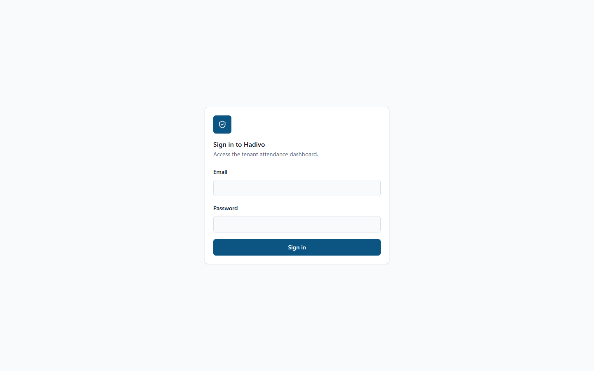
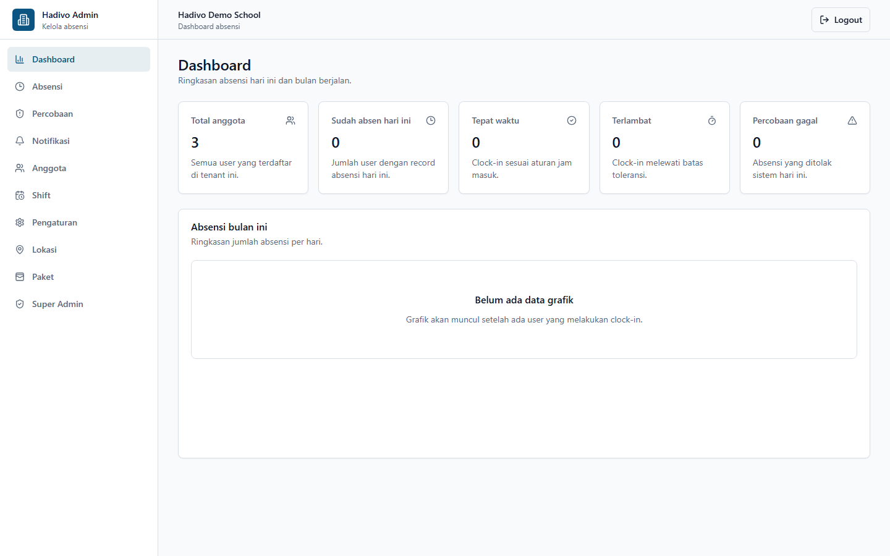
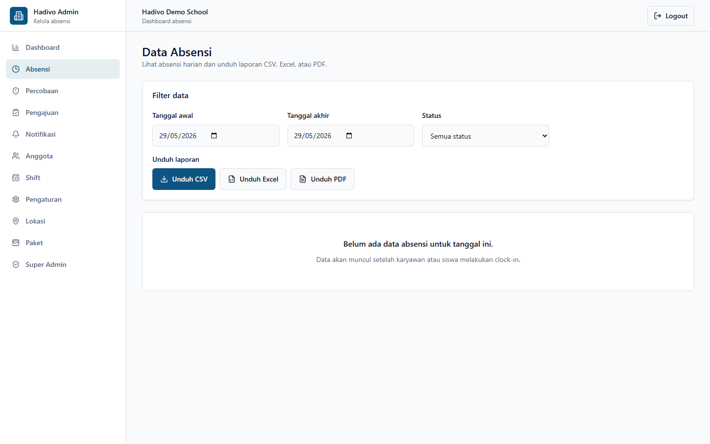
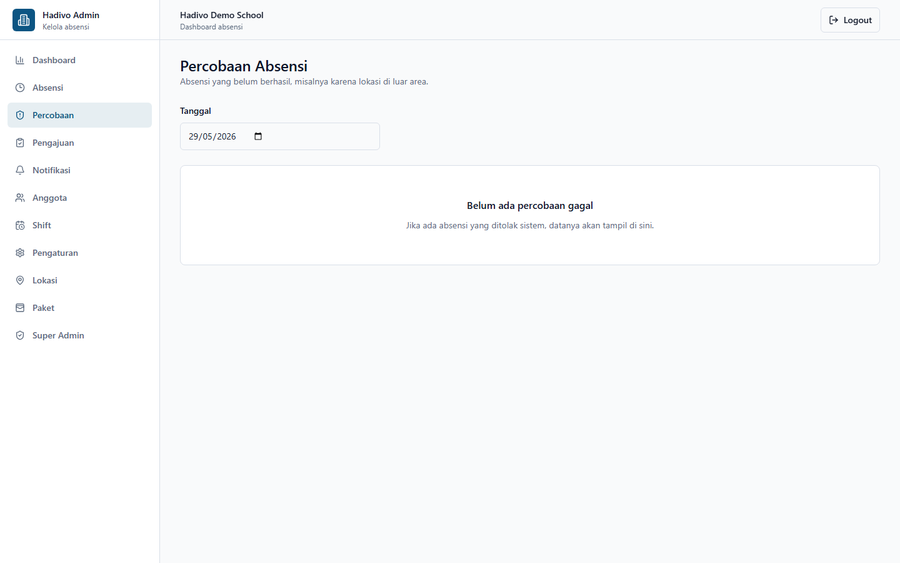
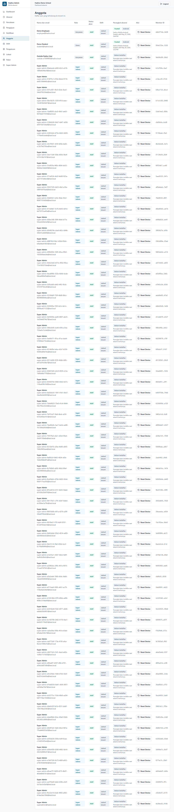
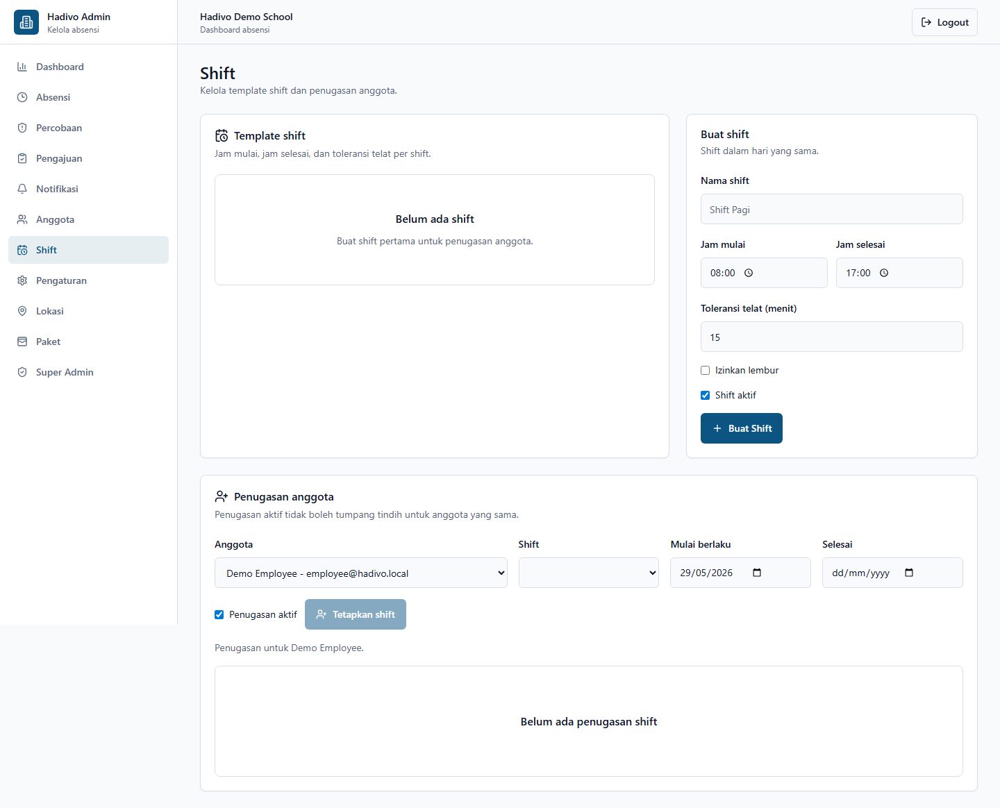
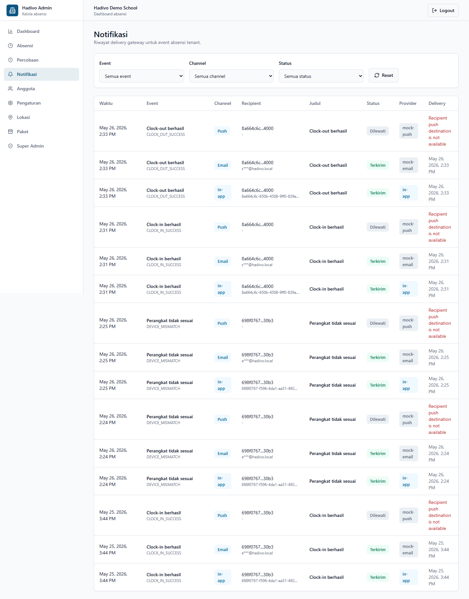
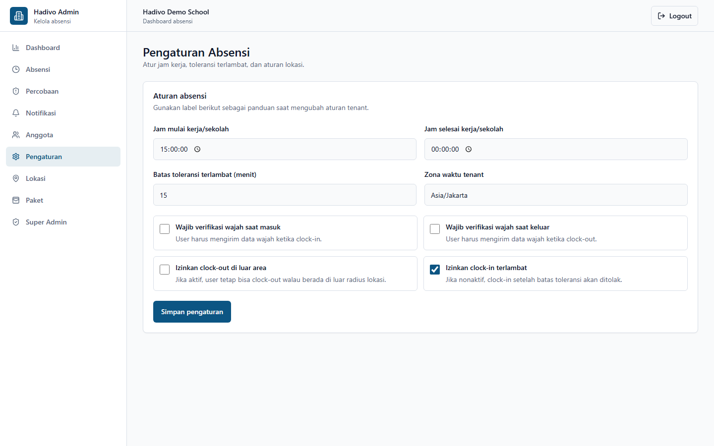
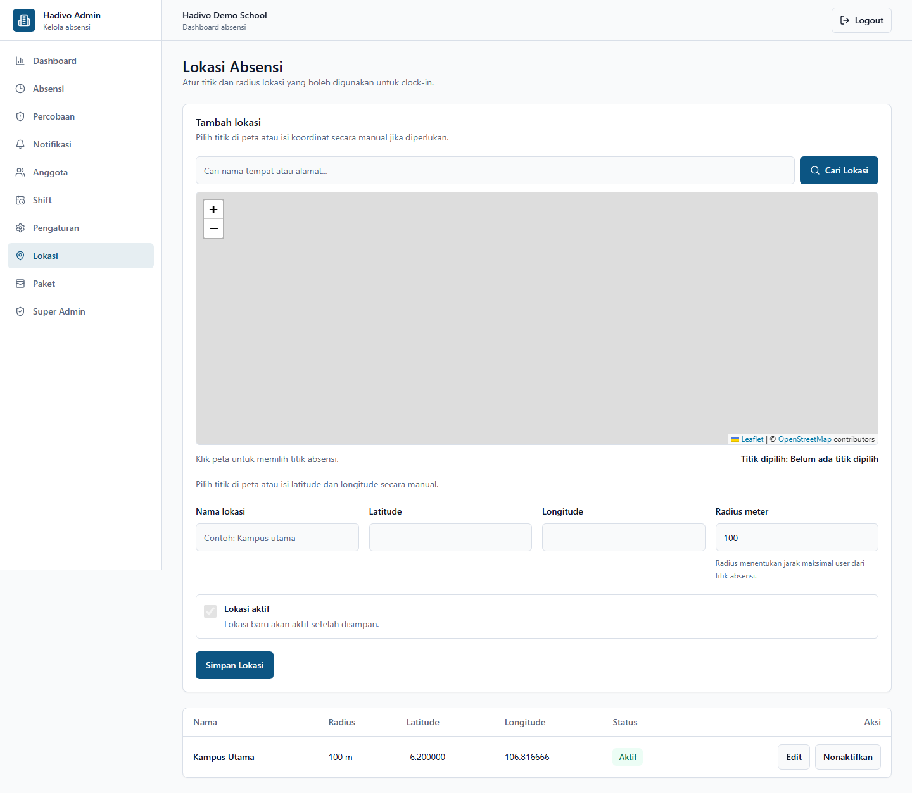
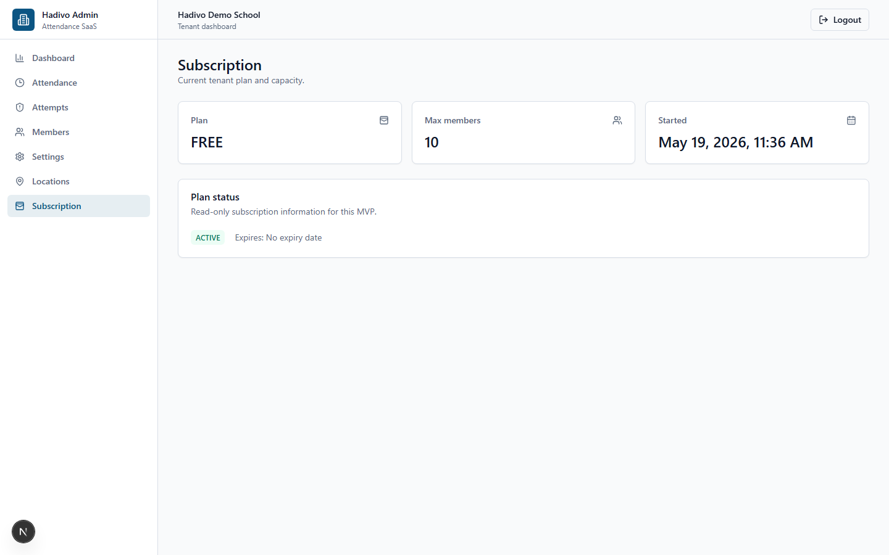
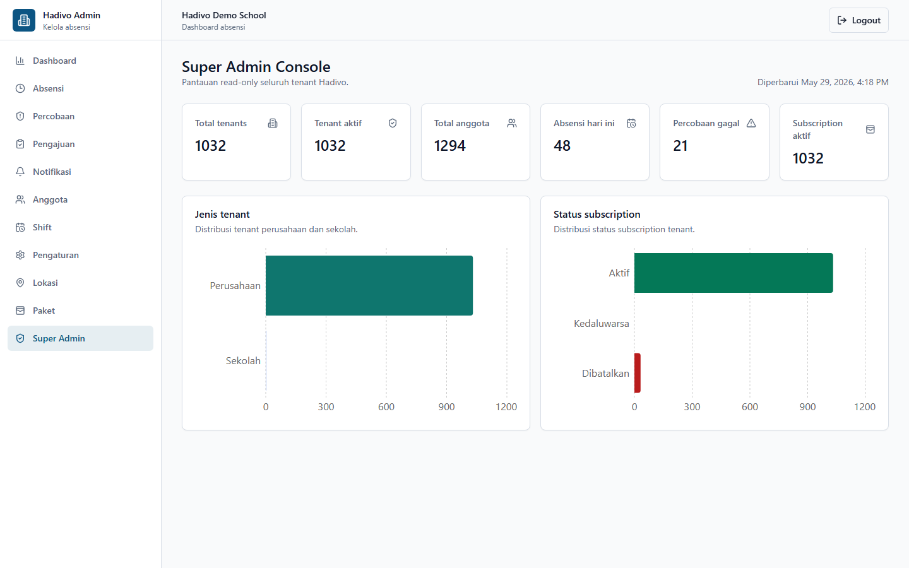
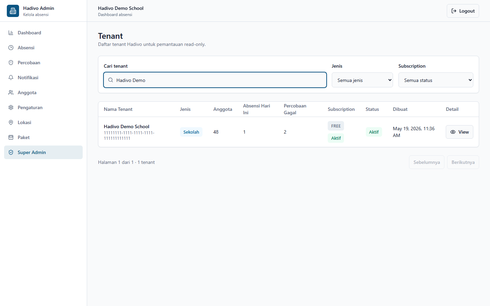
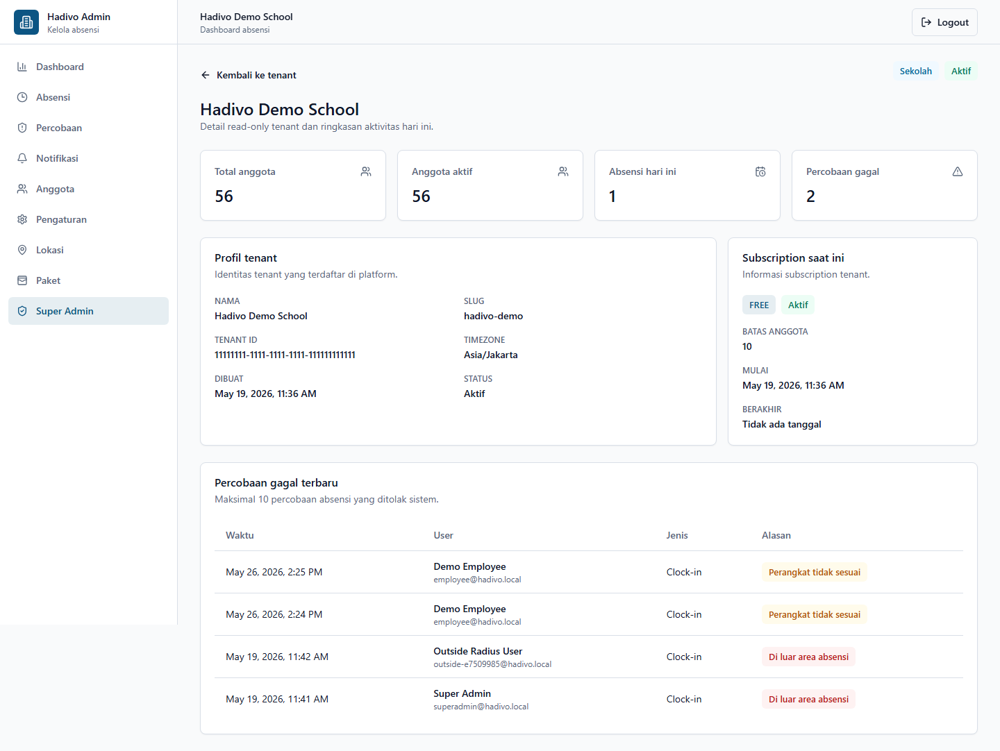

Responsive dashboard:

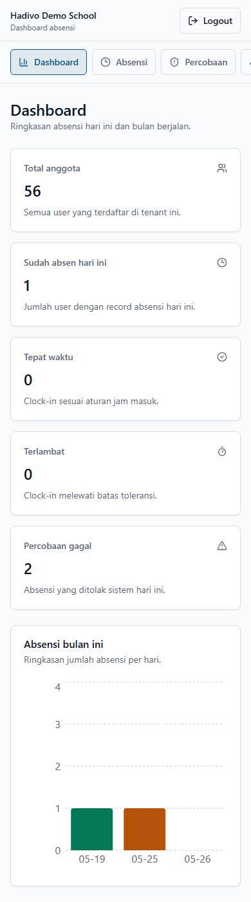
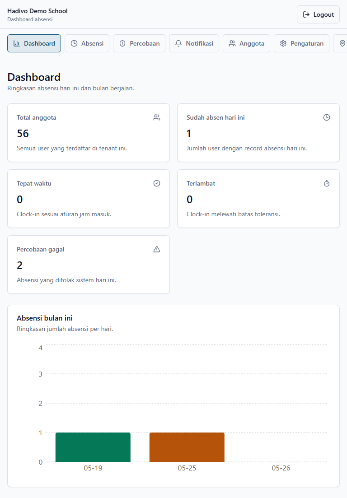


Swagger and Postman screenshots can be added after manual capture.

## Fitur Fase 1

- Auth JWT (register, login, refresh, logout) + refresh token rotation
- Tenant, membership, parent-student link
- Subscription dengan empat plan (FREE 10, PRO 100, BUSINESS 500, ENTERPRISE unlimited) dan payment foundation
- Tenant location + radius
- Tenant attendance settings yang dapat dikustomisasi (jam kerja, late threshold, face requirement, dll)
- Clock-in & clock-out dengan validasi geofence (Haversine) dan demo face verification
- `attendance_records` hanya menyimpan absensi sah; `attendance_attempts` mencatat percobaan gagal
- Event publish ke RabbitMQ **after commit** menggunakan `@TransactionalEventListener`
- Notification gateway foundation dengan queue async, mock/log-only email/push provider, delivery log, dan in-app notification storage
- Reporting harian & bulanan (JSON) serta export laporan attendance CSV, Excel, dan PDF
- Audit log untuk operasi absensi
- Postman collection siap pakai
- Unit test Haversine + integration test clock-in memakai PostgreSQL dari Docker Compose
- Web dashboard admin tenant untuk login, summary, attendance, attempts, members, shifts, settings, locations, subscription, dan payment history
- Flutter mobile attendance MVP untuk employee/student demo

## Fitur v0.5.0

- Endpoint `GET /api/v1/super-admin/overview`, `GET /api/v1/super-admin/tenants`, dan `GET /api/v1/super-admin/tenants/{tenantId}` khusus role `SUPER_ADMIN`.
- Overview lintas tenant: total tenant, tenant aktif, company/school, total member, attendance hari ini, failed attempts hari ini, dan subscription aktif/expired.
- Web Super Admin Console di `/super-admin`, `/super-admin/tenants`, dan `/super-admin/tenants/[tenantId]`.
- Daftar tenant dengan filter search, type, dan subscription status.
- Detail tenant read-only dengan current subscription dan failed attempts terbaru.
- Tidak ada edit/delete tenant, impersonation, payment gateway, face recognition asli, FCM/email production, atau device management dari fitur Super Admin v0.5.0.

## Fitur v0.6.0

- Tabel `user_devices` untuk trusted attendance device per tenant dan user.
- Clock-in/clock-out pertama dari user otomatis mendaftarkan device sebagai trusted device.
- Clock-in/clock-out dari device berbeda ditolak dan dicatat sebagai `DEVICE_MISMATCH`.
- Device ID kosong/tidak valid ditolak sebagai `INVALID_DEVICE`.
- Endpoint admin untuk melihat dan reset device member tenant.
- Halaman Members web menampilkan status device dan tombol Reset Device.
- Mobile app mengirim random device UUID yang disimpan di secure storage, beserta device name dan platform sederhana.
- Audit log untuk `DEVICE_REGISTERED`, `DEVICE_MISMATCH`, dan `DEVICE_RESET`.

## Fitur v0.7.0

- Notification gateway abstraction untuk event type, channel, template, gateway provider, publisher, consumer, service, dan delivery status.
- Queue RabbitMQ `hadivo.notification.events` untuk memproses notification request secara async setelah transaksi attendance commit.
- Tabel `notification_delivery_logs` untuk mencatat event, channel, recipient, destination, title, status, provider, error, dan waktu delivery.
- Provider mock/log-only untuk `EMAIL` dan `PUSH`; channel `IN_APP` tetap menulis ke tabel `notifications`.
- Event yang didukung: `CLOCK_IN_SUCCESS`, `CLOCK_OUT_SUCCESS`, `ATTENDANCE_OUT_OF_RADIUS`, `DEVICE_MISMATCH`, dan `ATTENDANCE_FAILED_ATTEMPT`.
- Endpoint read-only `GET /api/v1/tenants/{tenantId}/notification-deliveries` untuk admin tenant dan SUPER_ADMIN sesuai guard tenant.
- Web dashboard `/notifications` untuk melihat delivery log dengan filter status, channel, dan event.
- Audit log untuk `NOTIFICATION_PUBLISHED`, `NOTIFICATION_SENT`, dan `NOTIFICATION_FAILED`.

## Fitur v0.8.0

- Optional Resend email provider untuk notification gateway.
- Optional Firebase Cloud Messaging provider untuk push notification mobile.
- Provider default tetap mock/log-only jika env provider real belum lengkap.
- Endpoint `POST /api/v1/tenants/{tenantId}/notification-tokens` untuk register FCM token user yang sedang login.
- Tabel `notification_device_tokens` untuk menyimpan active FCM token per tenant/user/device.
- Delivery log memakai masked destination untuk email dan FCM token.
- Mobile app melakukan Firebase initialization dan token registration hanya jika `HADIVO_ENABLE_FIREBASE_MESSAGING=true`.
- Web Notifications menampilkan provider badge `mock`, `resend`, atau `fcm`.

## Fitur v0.9.0

- Endpoint export attendance Excel: `GET /api/v1/tenants/{tenantId}/reports/attendance/export.xlsx?from=YYYY-MM-DD&to=YYYY-MM-DD`.
- Endpoint export attendance PDF: `GET /api/v1/tenants/{tenantId}/reports/attendance/export.pdf?from=YYYY-MM-DD&to=YYYY-MM-DD`.
- Excel memakai Apache POI dengan sheet `Attendance Report`, title, period, header bold, freeze pane header, dan auto-size column.
- PDF memakai OpenPDF dengan title, period, generatedAt, tabel sederhana, multi-page otomatis, dan pesan kosong `No attendance data for this period.`
- CSV, Excel, dan PDF memakai data export yang sama agar hasil konsisten.
- Range export attendance tetap maksimal 31 hari untuk MVP.
- Audit log baru untuk `REPORT_EXCEL_EXPORTED` dan `REPORT_PDF_EXPORTED`.
- Halaman Attendance web menambahkan tombol `Unduh Excel` dan `Unduh PDF` di samping `Unduh CSV`.

## Fitur v1.0.0

- Tabel `subscription_packages` dan `payment_records` untuk fondasi payment subscription.
- Endpoint package catalog tenant: `GET /api/v1/tenants/{tenantId}/subscription-packages`.
- Endpoint create/list/detail payment tenant:
  - `POST /api/v1/tenants/{tenantId}/subscription-payments`
  - `GET /api/v1/tenants/{tenantId}/subscription-payments`
  - `GET /api/v1/tenants/{tenantId}/subscription-payments/{paymentId}`
- Public webhook Midtrans: `POST /api/v1/payments/webhooks/midtrans`.
- Provider payment default `mock`, tidak butuh API key untuk local dev dan CI.
- Provider Midtrans Snap optional, aktif hanya jika konfigurasi provider dan server key lengkap.
- Webhook Midtrans memverifikasi signature `SHA512(order_id + status_code + gross_amount + server_key)` dan mencocokkan amount dengan payment record.
- Status payment: `PENDING`, `PAID`, `FAILED`, `EXPIRED`, dan `CANCELLED`.
- Aktivasi subscription hanya dari backend setelah webhook valid; frontend tidak bisa mengaktifkan subscription.
- Audit log untuk `PAYMENT_CREATED`, `PAYMENT_WEBHOOK_RECEIVED`, `PAYMENT_STATUS_UPDATED`, `SUBSCRIPTION_ACTIVATED`, dan `PAYMENT_WEBHOOK_IGNORED`.
- Halaman Subscription web menampilkan current subscription, package selector, tombol `Buat Pembayaran`, tombol `Buka Halaman Pembayaran`, dan payment history.

## Known limitation (Fase 1)

- Super Admin Console v0.5.0 masih read-only.
- Belum ada edit/delete tenant dari Super Admin.
- Belum ada impersonation user.
- Billing/payment foundation sudah tersedia untuk tenant subscription, tetapi Super Admin belum memiliki billing analytics kompleks.
- Analytics Super Admin masih basic, berupa ringkasan count dan daftar tenant.
- Device binding bukan anti-fraud sempurna.
- Reinstall mobile app bisa menghasilkan device ID baru dan membutuhkan reset admin.
- Production bisa memperkuat device policy dengan attestation, liveness, MDM, atau posture checks.
- Face verification masih demo — hanya cek panjang base64. Interface `FaceVerifier` sudah siap diganti.
- Notification provider real v0.8.0 bersifat optional. Default tetap mock/log-only jika Resend/FCM belum dikonfigurasi.
- Belum ada SMTP, SMS, retry scheduler, notification preference center, atau production-grade token pruning.
- Payment foundation belum mencakup refund, recurring billing otomatis kompleks, proration, invoice PDF, payment email, atau settlement dashboard kompleks.
- Tidak ada WebSocket atau realtime push.
- Export laporan attendance masih dibatasi maksimal 31 hari per request dan belum memakai streaming besar, template editor, scheduler, email report, atau storage file permanen.
- Address search Locations web memakai Nominatim OpenStreetMap untuk demo/portfolio dan request ringan, bukan live autocomplete.
- Tidak ada integrasi Google Maps.
- Tidak ada routing atau navigasi peta.
- Tile OpenStreetMap public dan public Nominatim sebaiknya diganti provider resmi/berbayar atau self-hosted tile/Nominatim untuk traffic production yang besar.
- Mobile app belum memiliki offline mode, notification preference kompleks, map view, dan face recognition asli. Push notification production membutuhkan setup Firebase manual.

## Roadmap

| Fase | Lingkup |
| --- | --- |
| 2 | Real face recognition (ML / embedding) |
| 2 | Notification retry scheduler, provider observability, dan notification preferences |
| 3 | Mobile app (Flutter) |
| 3 | Web admin |
| 3 | Shift / jadwal fleksibel per user |
| 4 | Leave balance / accrual, attachment upload, holiday calendar, payroll grade correction audit, dan reviewer hierarchy (manager / teacher). |

## Lisensi

Internal. Belum publik.
